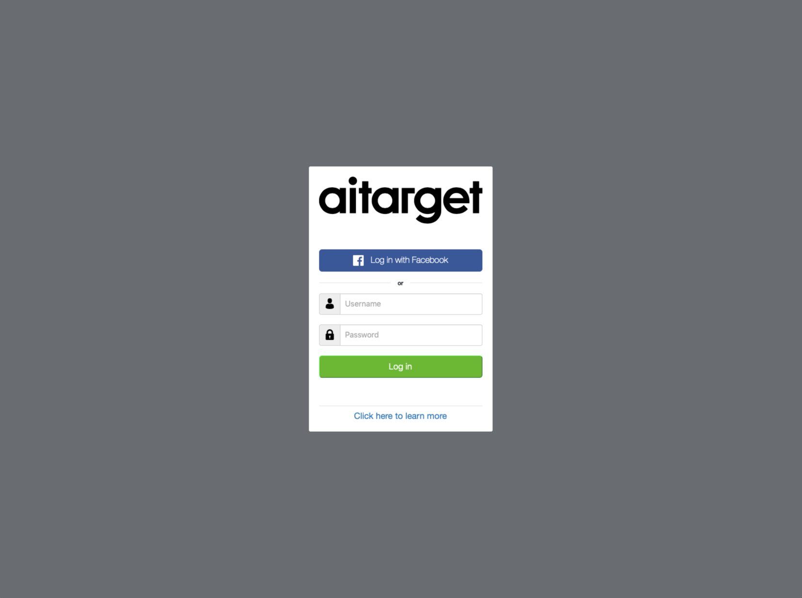
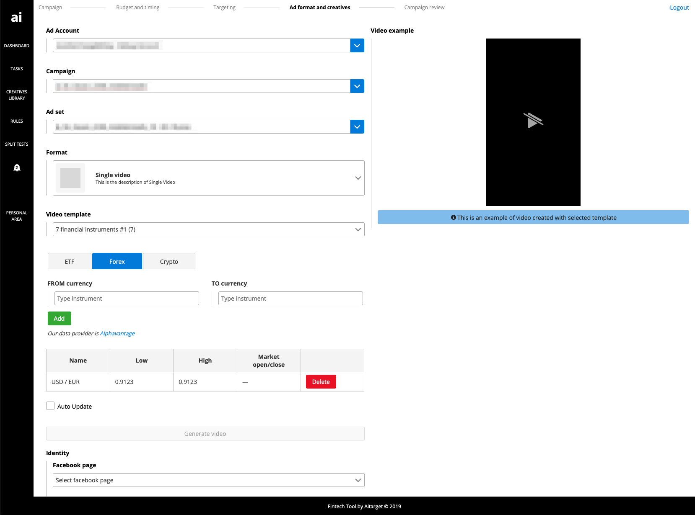
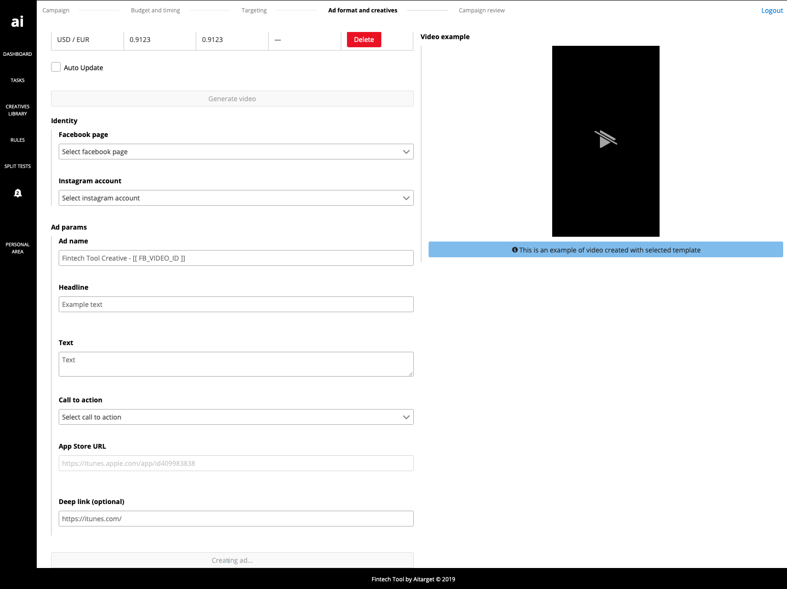
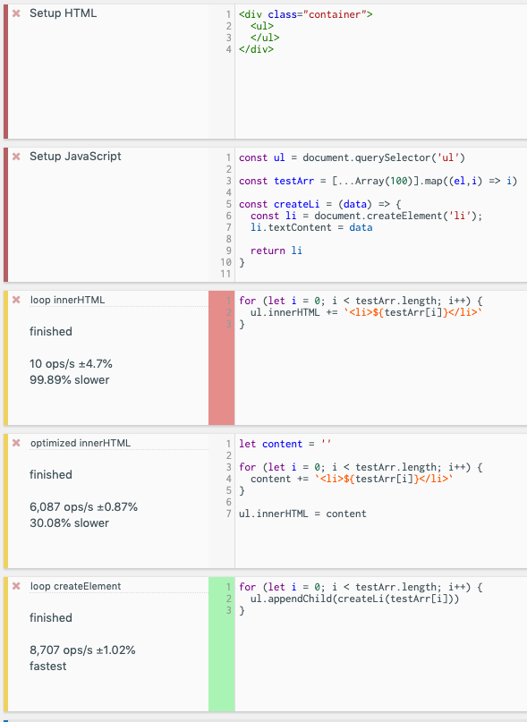

# Front end Engineer Challenge

## 1. About me

I don't have excellent commercial projects with these frameworks — most of my commercial projects based on React.
But I've done a couple of side and pet projects with Vue.js and Angular.  

My last commercial project with Angular:

### Fintech video tool

Fintech video tool provides to customers tools to manage Facebook ads campaigns. 
Customers can create tasks to generate video ads by a template and use actual information about financial instruments.  
Customers can choose a template, financial pairs and other params for Facebook ad and see the preview of the video ad.  

I've made frontend part of this project and backend service to proxy requests to [Alpha Vantage](https://www.alphavantage.co/). 

## 2. General

##### 2.1. What kind of front end projects do you enjoy working on? Why?

First of all, I enjoy working on projects, which are useful for people.   
I like such markets as education, health, books, space etc.  
Also, I prefer projects with interesting and challenging tasks.  
And no less important the team, which works on the project.  
It's significant for a project when people do their best and think about the quality of their work.

##### 2.2. Which are your favorite features of HTML5? How have you used them before?

I think that my favourite features are:  
1. New semantic tags
2. Inline SVG
3. New APIs, like video/audio, location and timeouts.

Also, as a tutor and code reviewer, I like `contenteditable` tag

##### 2.3. Explain the difference between creating a DOM element setting `innerHTML` and using `createElement`.

Firstly, value of `innerHTML` is `DOMString`, whereas value of `createElement` is an `Element`.  
It means that `createElement` provides more powerful tools to work with nodes.  
We can save events, links to `Element` when creating it. It could be useful if we work with a huge amount of nodes.  
Also, `innerHTML` can't be used with users data. There are potential security risks.  
Otherwise, in some cases `innerHTML` can be shorter and works faster. But generally, `createElement` is much quicker.  
For example, it's a simple benchmark:  

  
[https://jsbench.me/htk1c7megl/](https://jsbench.me/htk1c7megl/)  
  
In my opinion, in most cases, we can use `createElement`.  
But for some simple and little parts of markup `innerHTML` can be used too.  
Also, it's a convenient way to clear node. 

##### 2.4. Compare two-way data binding vs one-way data flow.

Two-way data binding means that UI is bound to model dynamically. If UI fields get updated, changes get sent to the model and vice-versa.

One-way data flow means that the model is the single source of truth. If UI changes, some events trigger to send a signal about changing to model.
Only the model can change data.  

They both have pros and cons:
- If data always flows in a single direction, it's easier to understand;
- One-way data flow is deterministic;
- The idea about two-way data binding requires more resources;
- Two-way data binding can be more difficult to understand;
- One-way data flow requires to create event handlers, updating of state, and re-rendering of the user interface to 
allow the simple act of typing text into an input element.
- Two-way data binding between components can be errored because of conflicting data from different
sources.

##### 2.5. Why is asynchronous programming important in JavaScript?

Asynchronous programming means that the engine runs in an event loop.  
When a blocking operation is needed, the request is started, and the code keeps running without blocking for the result.  
Javascript is a language, which we use to work with user interfaces.  
User interfaces are asynchronous. The central part of the projects consists of code, which waiting user input,  
trigger event, send request and receive responses from servers.  
If we want to create interfaces, which fit for users, we need to work with asynchronous programming. 
Otherwise, users will need to wait for server responses or some other actions.

## 3. Styling

Public url: [https://q3-reedsy.fyvfyv.com](https://q3-reedsy.fyvfyv.com)

[README.md](https://github.com/fyvfyv/challenges/tree/master/q3/README.md)

## 4. SPA

Public url: [https://q4-reedsy.fyvfyv.com](https://q4-reedsy.fyvfyv.com)

Vue.js app: [README.md](https://github.com/fyvfyv/challenges/tree/master/q4/front/README.md)  
Server: [README.md](https://github.com/fyvfyv/challenges/tree/master/q4/server/README.md)
